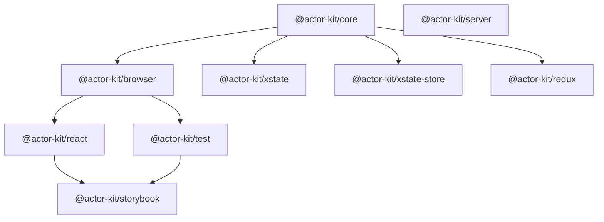

Actor Kit is organized into packages with strict dependency boundaries. The core package is library-agnostic — state management is pluggable via adapters.

## Module boundaries

| Package | Responsibility | Key deps |
|---------|---------------|----------|
| `@actor-kit/core` | `ActorLogic` interface, `defineLogic`, `createDurableActor`, auth | jose, fast-json-patch |
| `@actor-kit/browser` | WebSocket client, reconnection, state patching, selectors | fast-json-patch, immer |
| `@actor-kit/react` | Context, Provider, hooks (`useSelector`, `useSend`) | react |
| `@actor-kit/server` | JWT creation, HTTP snapshot fetching | jose |
| `@actor-kit/test` | Mock client, transition helper | immer |
| `@actor-kit/storybook` | `withActorKit` decorator, parameter-based snapshots | react |
| `@actor-kit/xstate` | XState v5 adapter (`fromXStateMachine`) | xstate, xstate-migrate |
| `@actor-kit/xstate-store` | @xstate/store adapter (`fromXStateStore`) | @xstate/store |
| `@actor-kit/redux` | Redux adapter (`fromRedux`) | — |

## Dependency graph



`@actor-kit/core` is the foundation — it defines the `ActorLogic` interface and the Durable Object runtime. Adapters (xstate, xstate-store, redux) depend on core. Browser/React packages are independent of the server path, so server code never ships to the browser.

`@actor-kit/server` is standalone — it provides `createAccessToken` and `createActorFetch` with no dependency on core's Cloudflare runtime.

## Type system

The `ActorLogic` interface is the contract between actor-kit and state management libraries:

```
ActorLogic<TState, TEvent, TView, TEnv, TInput>
  │
  ├─ create(input: TInput, ctx) → TState
  │   Creates initial state from input + actor context
  │
  ├─ transition(state, event & { caller, env }) → TState
  │   Pure state transition — event includes caller identity and env
  │
  ├─ getView(state, caller) → TView
  │   Caller-scoped projection — what each client sees
  │
  ├─ serialize(state) → unknown / restore(serialized) → TState
  │   Persistence boundary
  │
  └─ onConnect? / onDisconnect? / onResume?
      Optional lifecycle hooks
```

Key types:
- `Caller` — `{ type: "client"; id: string } | { type: "service"; id: string }`
- `TView` — user-defined view type (what clients receive over WebSocket)
- `TEvent` — user-defined event type (what clients send)
- `BaseEnv` — `{ ACTOR_KIT_SECRET: string; [key: string]: unknown }`

## Authentication flow

JWT-based, stateless authentication:

| JWT Claim | Maps to | Purpose |
|-----------|---------|---------|
| `jti` | Actor ID | Ties token to specific actor instance |
| `aud` | Actor type | Prevents cross-type token reuse |
| `sub` | `{callerType}-{callerId}` | Identifies the caller |
| `exp` | 30 days | Token lifetime |

Signing uses HS256 with `ACTOR_KIT_SECRET` from the Worker environment.

## Persistence model

When `persisted: true`:

1. **On spawn**: Actor metadata stored (`actorType`, `actorId`, `initialCaller`, `input`)
2. **On each transition**: Serialized state persisted via `logic.serialize()`
3. **On resume** (DO restart): State restored via `logic.restore()`, then `logic.migrate()` if provided
4. **Version tracking**: Stored alongside snapshot for version-based migration

## Sync protocol

See [Sync Protocol](/concepts/sync-protocol/) for the full description of checksum-based deduplication, JSON Patch diffs, and caller-scoped view delivery via `getView()`.
