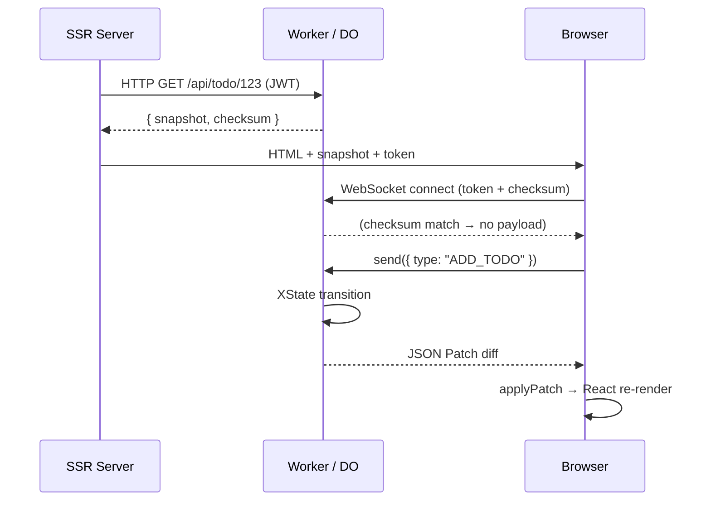
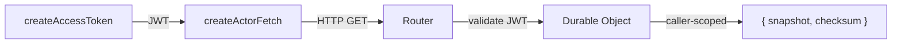
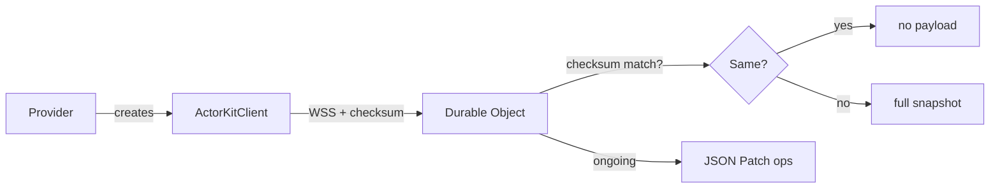
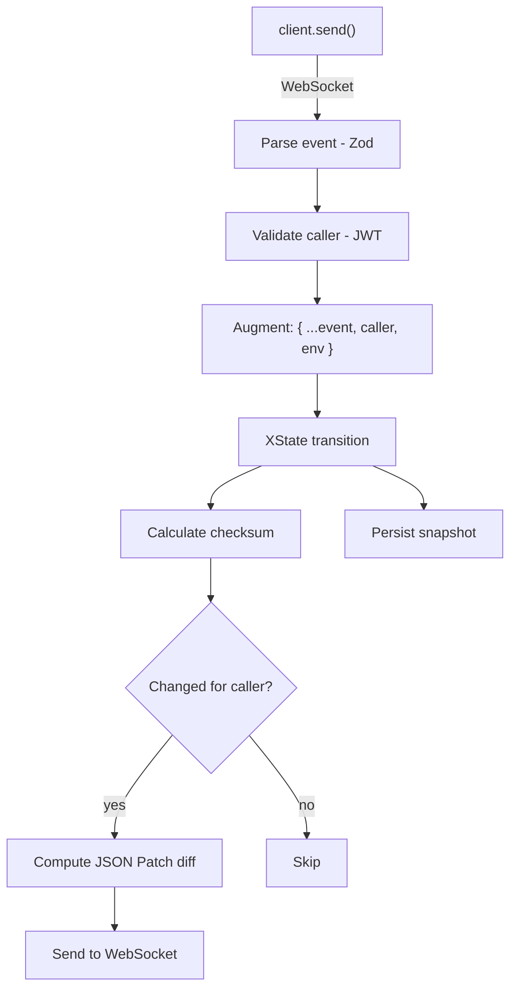
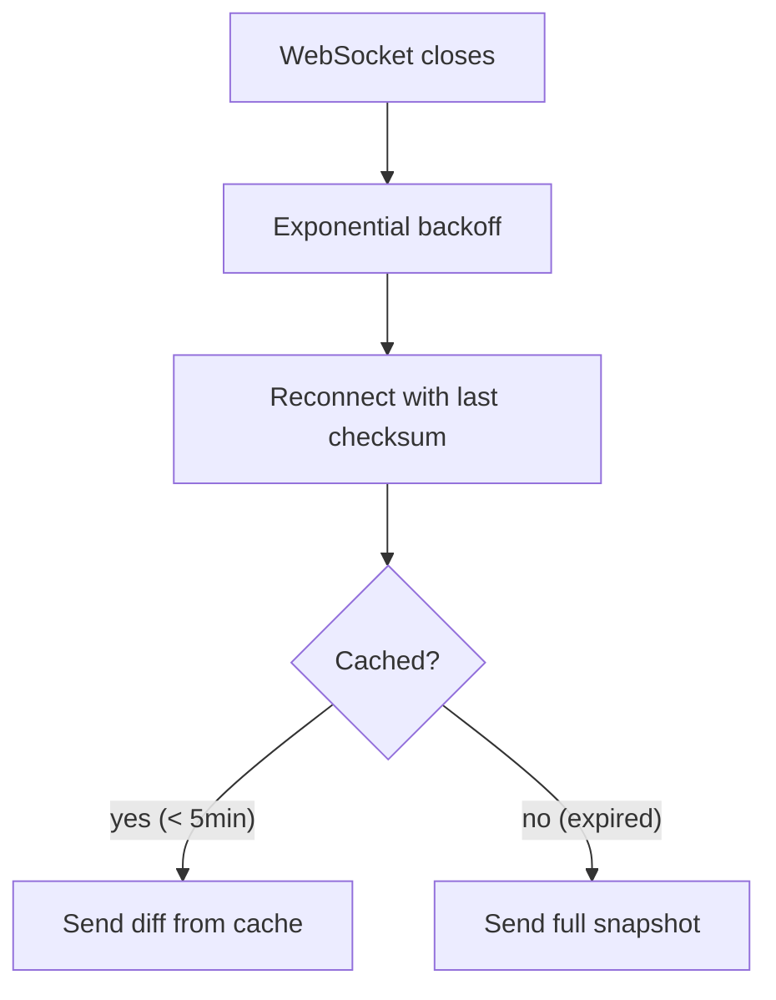

Actor Kit manages four phases of the actor lifecycle: initial load, client hydration, event processing, and reconnection.

## Overview

## 1. Initial page load (SSR)

Your server-side loader creates a JWT access token and fetches the initial snapshot from the Durable Object.

1. **`createAccessToken`** — signs a JWT with `jti`=actorId, `aud`=actorType, `sub`=callerType-callerId
2. **`createActorFetch`** — sends HTTP GET to `/api/{actorType}/{actorId}?accessToken=...`
3. **Router validates JWT** — spawns or retrieves the Durable Object
4. **DO returns** `{ checksum, snapshot }` — caller-scoped (public + this caller's private data)
5. **Loader returns** `{ accessToken, checksum, snapshot }` to the component

The snapshot is **caller-scoped**: it includes `public` context (shared with everyone) and `private` context (only for this caller).

## 2. Client hydration

Once the React app hydrates, the provider establishes a WebSocket connection.

1. **`<Provider>`** receives `host`, `actorId`, `accessToken`, `checksum`, `initialSnapshot`
2. Internally calls **`createActorKitClient({ initialSnapshot, ... })`**
3. On mount, calls **`client.connect()`** — opens WebSocket to `wss://host/api/{actorType}/{actorId}?accessToken=...&checksum=...`
4. Server validates the JWT
5. **Checksum handshake:**
   - If checksum matches current state → no initial payload (client is already current from SSR)
   - If checksum differs → full snapshot sent
6. **Ongoing:** JSON Patch operations sent for each state change

## 3. Event processing

When a client sends an event, the Durable Object processes it through the XState machine and broadcasts diffs.

1. **Parse** event against Zod schema
2. **Validate** caller identity from JWT claims
3. **Augment** event: `{ ...event, caller, storage, env }`
4. **Send** augmented event to XState actor: `actor.send(augmentedEvent)`
5. **XState transitions**: guards → actions → new state
6. **Checksum**: `getSnapshot()` → `calculateChecksum()`
7. **Broadcast** to each connected WebSocket:
   - Create caller-scoped snapshot
   - Compare with last sent checksum
   - If different: compute JSON Patch diff → send patch operations
   - If same: skip (no change for this caller)
8. **Persist** (if enabled): `storage.put(snapshot)`

**Client receives** JSON Patch → `applyPatch(state, ops)` → `useSyncExternalStore` → React re-render.

Key details:
- Events are **augmented** with `caller`, `storage`, and `env` before reaching the machine. Your guards and actions can use these to enforce access control.
- Each WebSocket gets a **caller-scoped diff**. Different callers may receive different patches for the same transition.
- Persistence happens **after** broadcast, so clients get updates as fast as possible.

## 4. Reconnection

If the WebSocket disconnects, the client reconnects with exponential backoff.

1. Client detects WebSocket close
2. **Exponential backoff** — up to 5 retry attempts
3. **Reconnect** with the last-known checksum
4. Server checks the **snapshot cache** (keyed by checksum, 5-minute TTL):
   - If cached → compute diff from cached state, send only the delta
   - If expired → send full current snapshot
