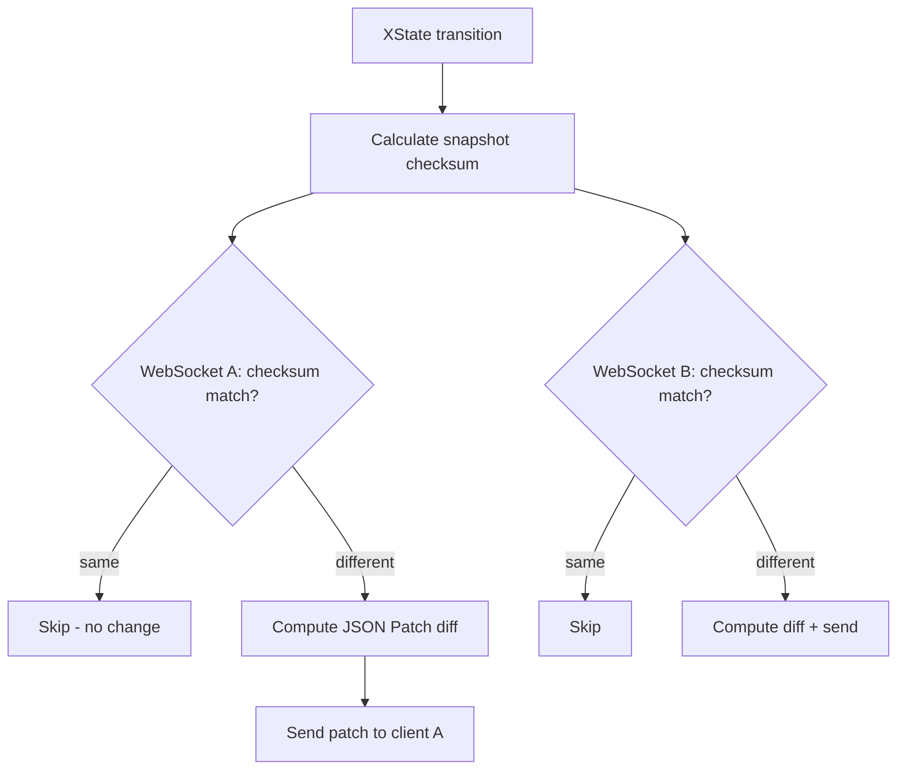

Actor Kit uses JSON Patch diffs with checksum-based deduplication to synchronize state between the Durable Object and connected clients.

## Checksum-based deduplication

Every snapshot is hashed (32-bit string hash). The server tracks the last checksum sent to each WebSocket. If the new checksum matches, no patch is sent.



This is especially efficient when a transition only affects one caller's private context — other callers' checksums won't change, so they receive nothing.

## JSON Patch diffs

When a caller's snapshot has changed, the server computes a [JSON Patch](https://jsonpatch.com/) (RFC 6902) diff between the previous and current snapshot:

```json
[
  { "op": "add", "path": "/public/todos/1", "value": { "id": "abc", "text": "New", "completed": false } },
  { "op": "replace", "path": "/public/lastSync", "value": 1710000000 }
]
```

The client applies these patches to its local snapshot and notifies React subscribers via `useSyncExternalStore`.

## Snapshot cache

The server caches recent snapshots (keyed by checksum, 5-minute TTL). This enables efficient reconnection:

- **Client reconnects with a recent checksum**: server finds the cached snapshot, computes a diff from that point, and sends only the delta.
- **Client reconnects with an expired checksum**: server sends the full current snapshot.

## Initial connection handshake

When a WebSocket connects, it includes the checksum from the SSR-fetched snapshot:

```
wss://host/api/todo/todo-123?accessToken=...&checksum=abc123
```

If the checksum matches the current state, no initial payload is sent — the client already has the latest data from SSR. If it differs (another client changed state between SSR and WebSocket connect), the server sends the full snapshot.

## Caller-scoped snapshots

Before computing diffs, the full snapshot is filtered per-caller:

```typescript
callerSnapshot = {
  public: fullSnapshot.context.public,
  private: fullSnapshot.context.private[caller.id] ?? {},
  value: fullSnapshot.value,
}
```

This means different callers may receive different patches for the same transition. A change to one caller's private context produces a patch only for that caller — all others see no change.
